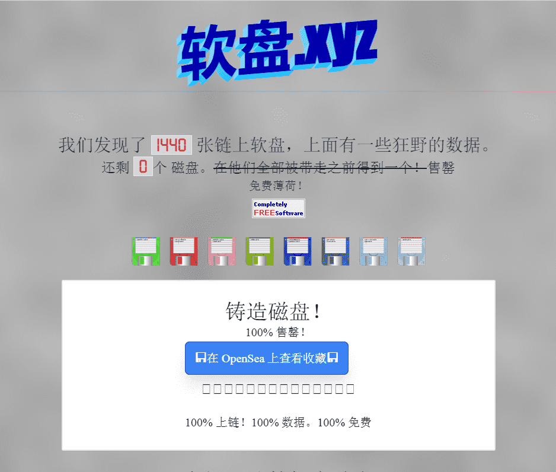

# Floppydisk.xyz

很久很久以前——在你可以将所有文件转储到云中之前的几年，在 1TB SD 卡出现之前——早期的计算机用户将文件存储在一个由一种称为软盘的塑料保护的磁铁上。按照今天的标准，软盘没有数据，速度极慢，而且很容易损坏。还是不明白？没关系，只需将它们视为 3D 打印的保存图标即可。

我们通过银河软盘 NFT 向这项几乎灭绝的技术致敬。

软盘可能会被一粒灰尘破坏。Galactic 的软盘是永久的——使用 SVG 数据直接从区块链渲染有数百万种可能的组合可以组合在一起来制作您独特的软盘，这些软盘是在铸币时从 5 种不同的稀有性特征中创建的

