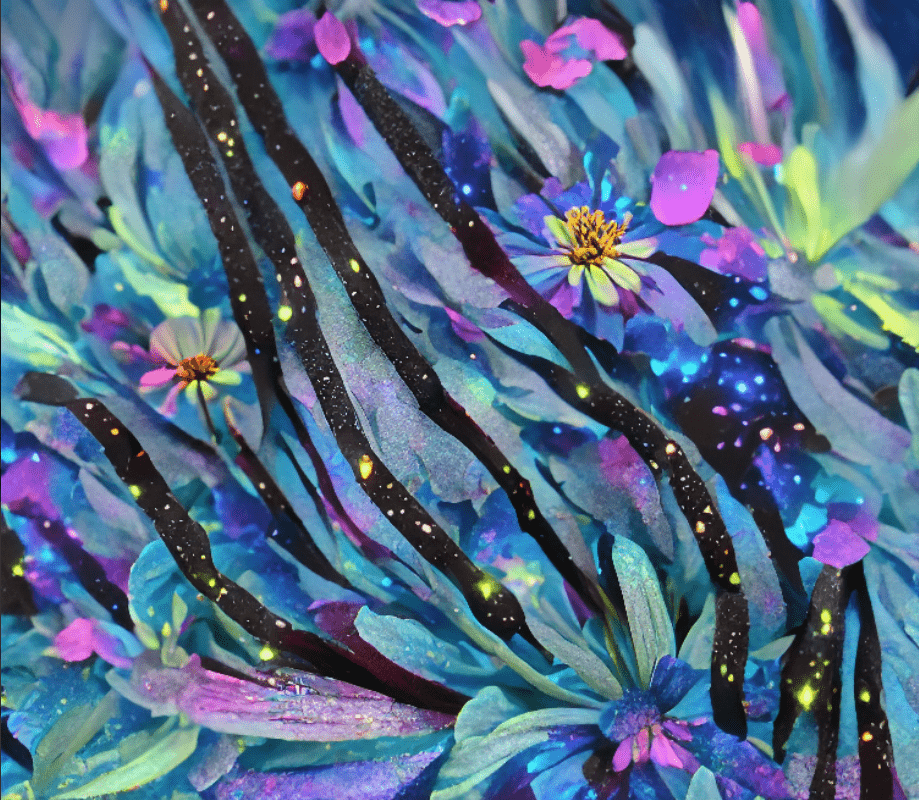

# !floradenza

!floradenza 是一个 NFT（不可替代代币）集合。存储在区块链上的数字艺术品集合。

总共有 404 个 !floradenza NFT。目前 112 位车主的钱包中至少有一个 !floradenza NTF。

404 ai 由 Errorgardener 收获的插花。与 Wolfbear Studios 合作发展。

“你不能 DMCA 我的心。” - !floradenza

WolfBear 是由艺术家 [Patrick Hoepner](https://twitter.com/ExquisiteCorps5) 和 [Jordan Meyer](https://twitter.com/JordanCMeyer)创立的软件工作室，他们在软件开发、机器学习、视频制作和视觉设计方面拥有数十年的经验。

我们的艺术作品是使用我们为个别艺术家（如 [Holly Herndon](https://foundation.app/@hollyherndon)和[Boreta](https://twitter.com/boreta) ）量身定制的定制神经网络和软件创作的。

