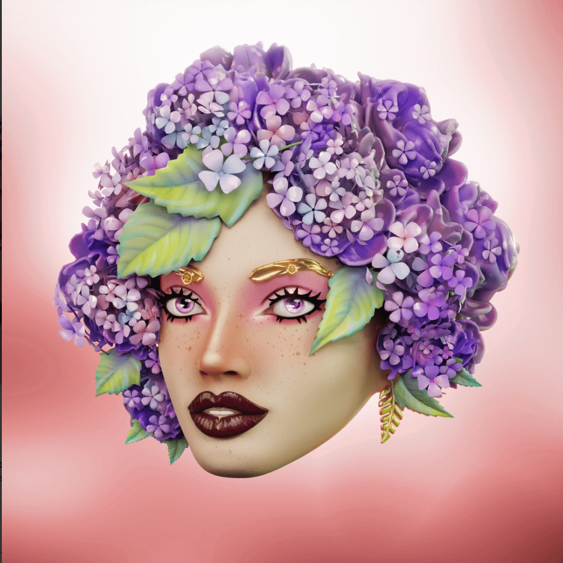

# Flower Power NFTS Genesis

在区块链上绽放的花头源于大自然，每一个特征都代表着一朵盛开的花朵。该系列由 3,333 个独特的雌性花头组成。

我们才华横溢的 3D 艺术家从异国情调的花朵中寻找灵感，创造出个性鲜明、态度多彩的古怪有趣的头像！这些女士绽放美丽，真正的艺术品，蓬勃发展，大胆，突出的特征代表了所有类型的女性。

所有的花都受到大自然之美的启发，每个特征都受到植物或花朵的启发。我们的艺术家研究了植物背后的象征，这些象征代表了花卉力量运动的理想，如自由、和平、承诺、权力和爱。

Flower Power NFTs 是 NFT 空间中的一项积极运动，其灵感来自最初的 Flower Power 运动。社区处于最前沿，为 OG 成员提供关键决策、合作和机会，以权衡项目合作伙伴关系和总体方向。我们的目标是通过精美的艺术品和最重要的忠诚社区为空间带来和平、乐趣和轻松。

