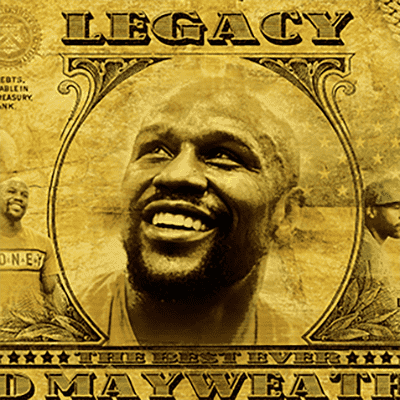

# Floyd Mayweather Jr.

GWSO——地球上最好的电池技术，最优秀的科学家齐聚一堂。

GWSO 预计将于 9 月向世界推出。该公司并没有停止他们计划使用绿色能源生产更多产品的电池。这是一家上市公司。

Floyd Mayweather Jr. NFT 系列名为“The Legacy”——庆祝 Mayweather 的生活和职业生涯的遗产。

什么是小弗洛伊德梅威瑟？

Floyd Mayweather Jr. 是一个 NFT（不可替代代币）系列。存储在区块链上的数字艺术品集合。

有多少 Floyd Mayweather Jr. 代币？

总共有 51 个 Floyd Mayweather Jr. NFT。目前，14 位车主的钱包中至少有一个 Floyd Mayweather Jr. NTF。

最近卖出了多少 Floyd Mayweather Jr.？

在过去 30 天内售出了 0 个 Floyd Mayweather Jr. NFT。

