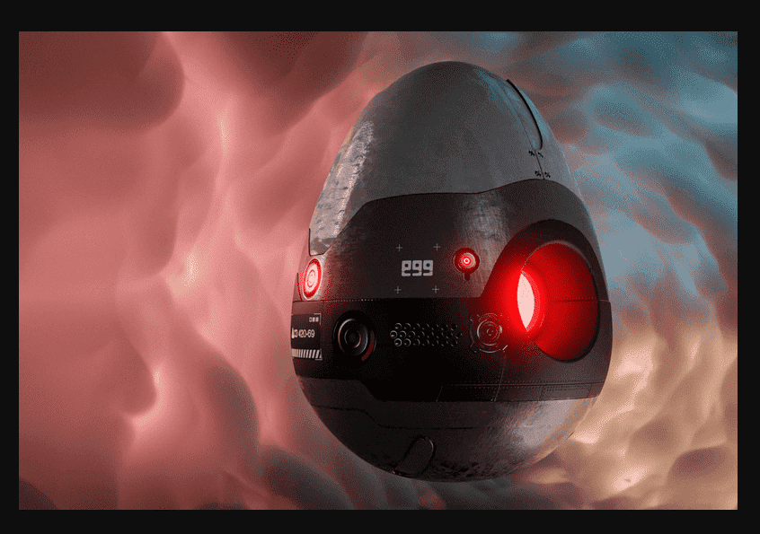

# FLUF World: EGGs

启动了 EGG（电菌体基因组发生器）以启动 FLUF World 的第一阶段育种。
每个 EGG 都是 Sparkenski 实验室的孵化室，能够从亲代 Fluf DNA 中产生未来的 Fluflets。
以 5 种稀有类型发布，具有改变性能的神秘属性，它们将如何影响 FLUF World 的后代是一个等待破解的密码。

免责声明 此 EGG 不受《法规》第 420 节第 69 小节中概述的 Fluflet 设计管理局 (FDA) 性能标准的约束。设备受到菌丝体频率 (EMF) 波动的影响。可能产生意想不到的基因组突变。Sparkenski Laboratories 对该设备的操作所产生的结果不承担任何责任。使用风险自负。

