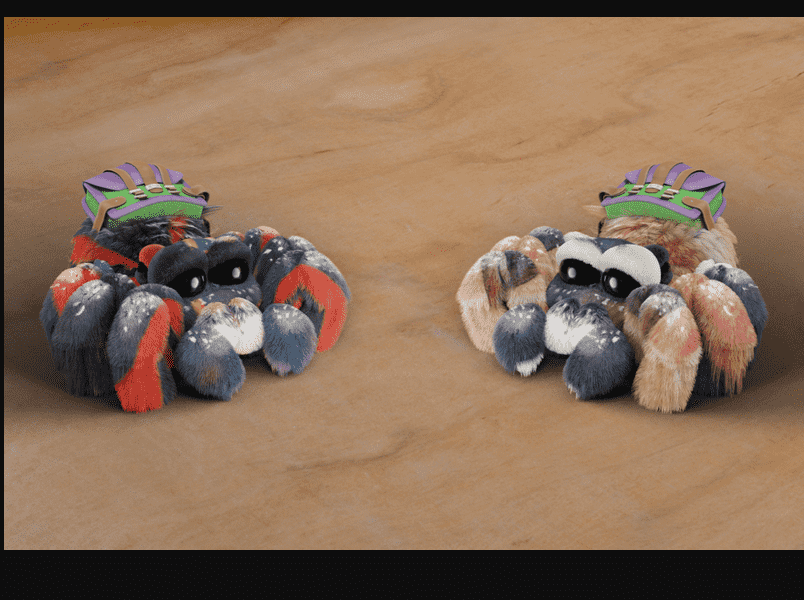

# FLUF World: Thingies

生人工智能艺术的人工智能艺术家！[改变状态机集成……他们的旅程才刚刚开始。

Thingies 是 10,000 只毛茸茸的蜘蛛状小动物，里面装满了数不清的惊喜。以编程方式生成，每个 Thingie 都是一个可用于元节的 3D 化身；您可以收集、交易和分享。

但它们不仅仅是毛茸茸的面孔……每个 Thingie 都是 ASM AI 集成艺术家，能够制作自己的 NFT 艺术。每个毛皮图案都是一个独特的抽象设计，也是由人工智能创造的！它们不仅仅是艺术品……它们是艺术品，正在工作。

