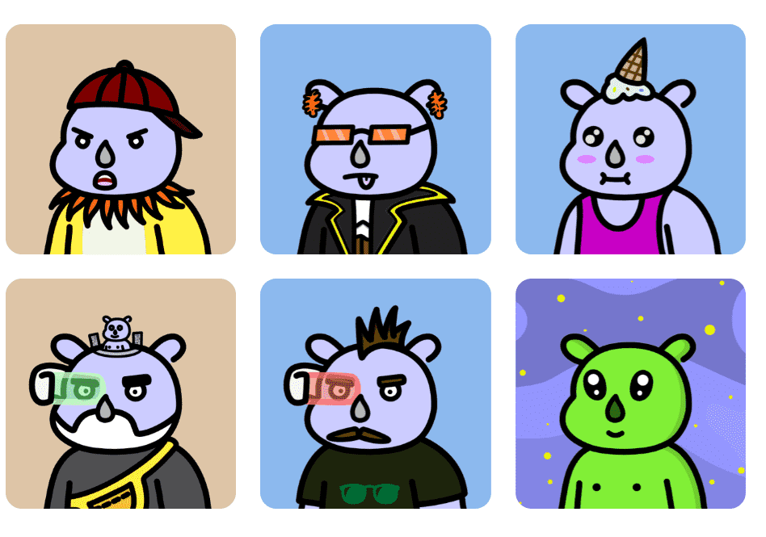

# Flufferz

Flufferz 是以太坊区块链上 8,888 个 NFT 的集合。（有没有想过为什么这些（Flufferz）变得蓬松？我们从来没有。）
无论您想要一个酷酷的蓬松角色还是以其魅力而闻名的角色，我们都会考虑到最蓬松的角色。每个绒毛都具有 300 多种特征变化，并且都有一个共同点：酷。
他们可能会吃很多东西、编码和睡觉，但他们也会给有需要的人提供食物。我们正在回馈无家可归者，我的朋友。不是你，你他妈的有钱。

