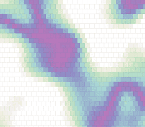

# Fluid Forms

项目网站、社交联系方式、项目介绍内容详见：https://opensea.io/collection/fluid-forms

 当今设计师的工作，不是寻找唯一有趣的形状，而是寻找一系列形状，不是定义实体和静态形式，而是定义流体形式，可以根据客户的需求进行变化，同时保持其自身的特征及其功能和美学价值。我与 Fluid Forms 的首席执行官 Hannes Walter 讨论了这个问题以及更多内容。

