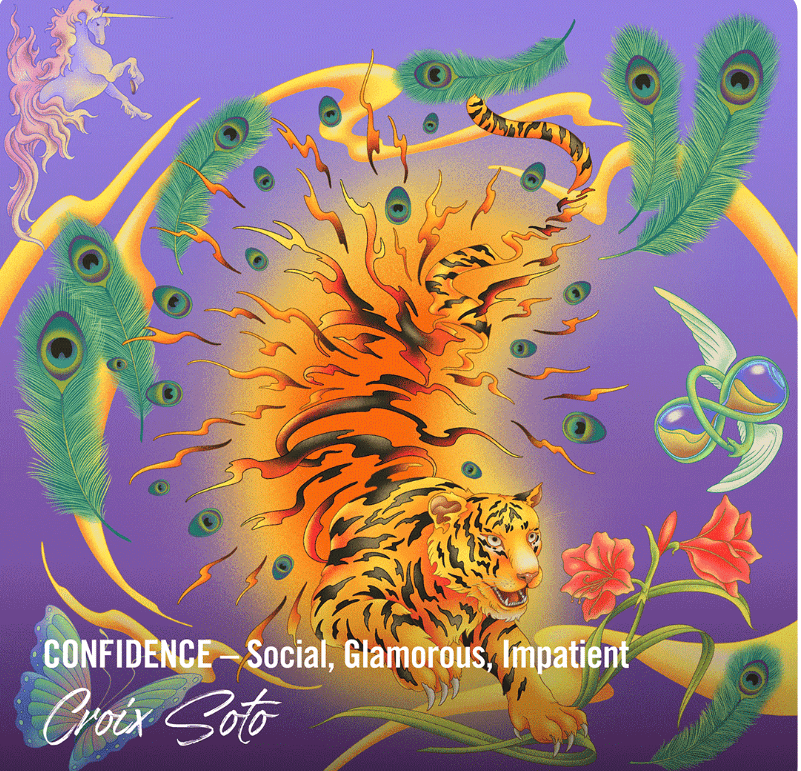

# Flying Formations

Flying Formations NFT 的赎回已经开始，并将持续到 6 月 30 日。== 如果对实体鞋的赎回要求对您很重要，我们强烈建议投标人不要在该市场上使用常规投标，存在以下风险：恶意卖家可以赎回他们的 NFT 并立即接受对该 NFT 的长期投标。强烈鼓励对交易未赎回 NFT 感兴趣的人直接参与 Flying Formations 官方 Discord == Flying Formations 是 Ducks of a Feather 项目的第一个系列。这是由 Tinker Hatfield 创建的 120 个独一无二的 NFT 的限量版系列，旨在造福俄勒冈大学的鸭子运动员。它代表了 Division Street 的“Ducks of A Feather”的初始产品，这是一项以俄勒冈大学运动员为特色的持续营销计划。

