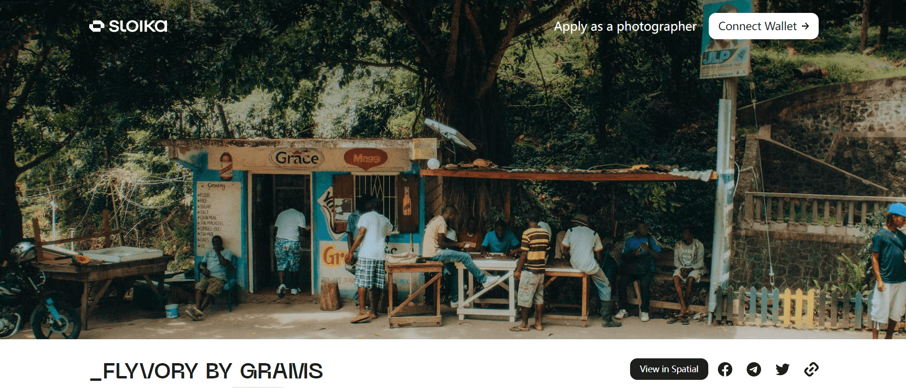

# _FLYVORY by GRAMS

在金斯顿外的山丘上，
象牙在空中飞过，
所有人都竞相倾倒
目标，
用拳头泵打低端。

Edward Grams 是纽约市的视觉制造商，致力于通过介于已发生和已发生之间的工作来扩展视角。通过艺术创作以促进积极的心理健康，回馈社区+支持致力于进步的组织。通过自然+旅行强制脱离有毒的办公室文化+不健康的工作与生活平衡的重要性，让人们重新发现批判性思维+存在。别的都无所谓。

