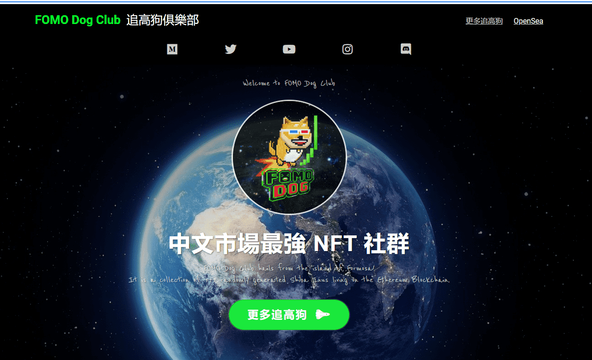

# FOMO Dog Club

FOMO Dog Club 来自福尔摩沙岛！

它是生活在以太坊区块链上的 777 个随机生成的 Shiba Inus 的集合。

NFT 持有者可以独家访问专用的 Discord 服务器：“Apollo 88”和许多未来的好处。

如果你自己 FOMO，你就是加密货币中的 NGMI，在这个俱乐部，我们将一起 FOMO，瞄准月球！

FOMO Dog Club NFT 在过去 7 天内售出 3 次。FOMO Dog Club 的总销售额为 7.88 万美元。一份 FOMO Dog Club NFT 的平均价格为 2.6 万美元。共有 633 位 FOMO Dog Club 所有者，总供应量为 777 个代币。

