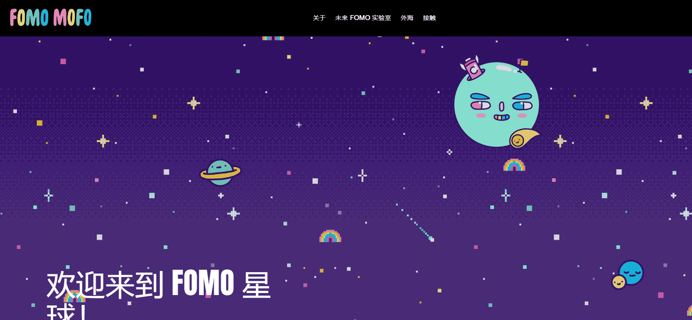

# FOMO MOFOS

由著名艺术家 Jasper Wong 创作的一系列 8,008 件独特的收藏品。FOMO MOFO 的灵感来自我们热爱和成长的多彩世界。FOMIES 具有广泛的特征，具有数百个变量，使每个变量都与众不同。FOMO MOFO 是家庭和社区的一部分，未来的项目由 FOMIE 社区财政部和未来的收藏品资助。

什么是 FOMO MOFO？

是我们！是热爱艺术、文化、美食、动漫、宠物、电影、卡通、电视节目、体育、电子游戏、加密货币、NFT、漫画、运动鞋等的人们。我们从小就恋爱了，成年后我们仍然在恋爱中。我们每个星期六早上都看动画片，害怕错过下一集或弧线是我们最大的担忧之一。FOMO 一直存在，但它也将像我们这样的人与拥有相同激情的更大社区联系起来。我们会结合并谈论几个小时，谈论我们全神贯注的故事和世界。这个项目是为那些不怕向世界展示他们有多爱 FOMO 的志同道合和充满激情的人准备的！

FOMO MOFO 为社区服务，为社区服务。这个 NFT 集合由数百个特征组成，这些特征使每次迭代都完全独一无二。还有一组使用全新基础的稀有 FOMO MOFO，以及 10 个超级稀有的 1-of-1 NFT。FOMO MOFO 全部由艺术家 Jasper Wong 手绘。每个 FOMO MOFO 都是存在于以太坊区块链上的不可替代代币 (NFT)。在 Twitter 和 Discord 上加入 FOMO MOFO 社区。

