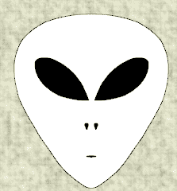

# FOMOAliens

项目网站、社交联系方式、项目介绍内容详见：https://opensea.io/collection/fomoaliens

  ▶ 什么是 FOMOAliens？

FOMOAliens 是一个 NFT（不可替代令牌）集合。存储在区块链上的数字艺术品集合。

##### ▶ 有多少个 FOMOAliens 代币？

总共有 601 个 FOMOAliens NFT。目前，237 位所有者的钱包中至少有一个 FOMOAliens NTF。

##### ▶ 最近卖出了多少 FOMOAliens？

过去 30 天内售出 0 个 FOMOAliens NFT。

