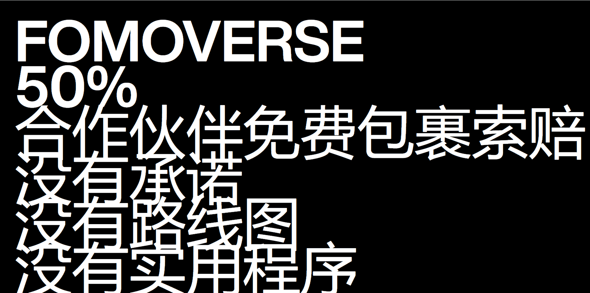

# Fomoverse

什么是 Fomoverse？

Fomoverse 是一个 NFT（不可替代代币）集合。存储在区块链上的数字艺术品集合。

有多少 Fomoverse 代币？

总共有 1,234 个 Fomoverse NFT。目前，772 位所有者的钱包中至少有一个 Fomoverse NTF。

最昂贵的 Fomoverse 销售是什么？

出售的最昂贵的 Fomoverse NFT 是它于 2022 年 8 月 22 日（11 天前）以 1.1 万美元的价格售出。

最近卖出了多少 Fomoverse？

过去 30 天内售出了 13 个 Fomoverse NFT。

Fomoverse 的成本是多少？

在过去 30 天里，最便宜的 Fomoverse NFT 销售额低于 611 美元，最高销售额超过 1038 美元。Fomoverse NFT 在过去 30 天内的中位价格为 774 美元。

