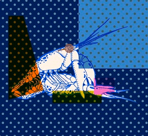
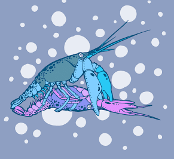
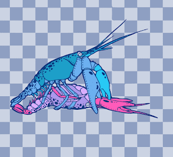

# Food and Love Indigo Series

项目网站、社交联系方式、项目介绍内容详见：https://opensea.io/collection/food-and-love

小龙虾是世界上做爱时最接近人类的姿势。做爱时，无论男女，小龙虾通常都践行标准的“传教士作风”，认真负责，永不言弃。脉轮是人体能量的中心。有七个曼陀罗脉轮，呈现七种颜色的光，从下到上是红、橙、黄、绿、靛、蓝、紫，就像彩虹的颜色。靛蓝是第六脉轮：第三眼脉轮，俗称第三眼。它指的是我们眉毛的中间部分。从这里开始，人们开始走向上帝。

