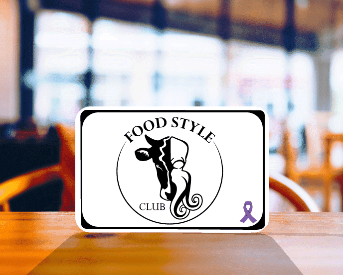

# Food Style Club

FOOD STYLE CLUB 是 NFT 餐厅的一个项目，旨在提高对饮食失调问题的认识。

食谱是 250 个手绘 1/1 NFT 的集合，其中包含精心挑选的东西方美食风格的食谱。

*Style Club* 是适合任何时候饥饿的完美无忧、快速健康的选择。孟买三明治是一种即食早餐。

在过去 7 天内售出 2 次。食谱的总销售额为 63.67 美元。平均价格为 31.8 美元。有 138 个 食谱所有者，拥有 250 个代币的总供应量。

