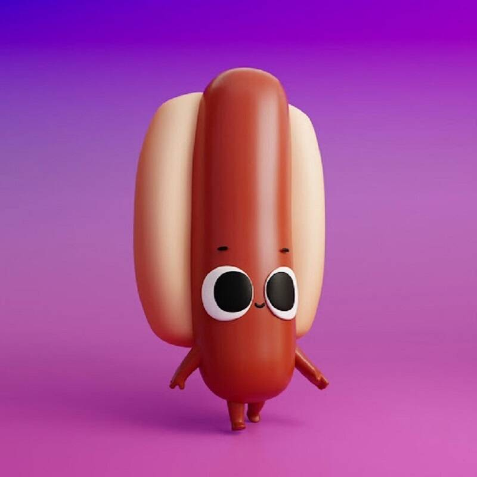

# Foodz Party

项目网站、社交联系方式、项目介绍内容详见：https://opensea.io/collection/foodzparty

Foodz Party 是一个生成 3D 动画作为特征的集合，其中包含 3,500 个 Foodz，它们存在于以太坊区块链上。Foodz 是 Genzee 宇宙的一部分。并将让您获得第一批 Spiritz 瓶子！Foodz 也可以被质押以生成 $ODDX，该 $ODDX 可用于兑换 Oddworx 商店中的实体和数字收藏品。

▶ 什么是 Foodz 派对？
Foodz Party 是一个 NFT（非同质代币）集合。存储在区块链上的数字艺术品集合。
▶ 有多少 Foodz Party 代币？
总共有 3,371 个 Foodz Party NFT。目前，317 位业主的钱包中至少有一个 Foodz Party NTF。
▶ 最昂贵的 Foodz Party 销售是什么？
售出的最昂贵的 Foodz Party NFT 是 Clean Hotdog。它于 2022-06-29（大约 2 个月前）以 691.6 美元的价格售出。
▶ 最近卖出了多少 Foodz Party？
过去 30 天内售出了 38 个 Foodz Party NFT。
▶ Foodz 派对的费用是多少？
在过去 30 天里，最便宜的 Foodz Party NFT 销售额低于 31 美元，最高销售额超过 73 美元。过去 30 天内，Foodz Party NFT 的中位价格为 44 美元。
▶ 什么是流行的 Foodz Party 替代品？
许多拥有 Foodz Party NFT 的用户还拥有 Genzee、 Hapee Frens、 Golden Pass和 Status Effect。

