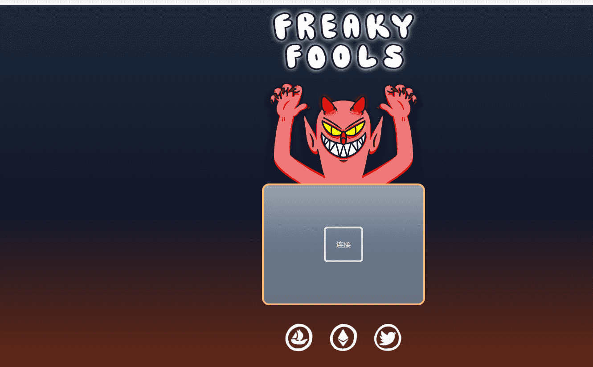

# Fools NFT

2222个傻子的集合，屈服于隐藏文件夹的恐怖和疯狂，并以Freaky Fools的形式出现

非官方社区运行 Fools / Freaky Fools discord Fools NFT NFT 在过去 7 天内售出 1 次。Fools NFT 的总销售额为 5.49 美元。一个 Fools NFT NFT 的平均价格为 5.5 美元。有 561 个 Fools NFT 所有者，拥有 1,111 个代币的总供应量。

1111 个傻瓜的集合，在以太坊区块链上散布着恶作剧和汤姆愚弄。

