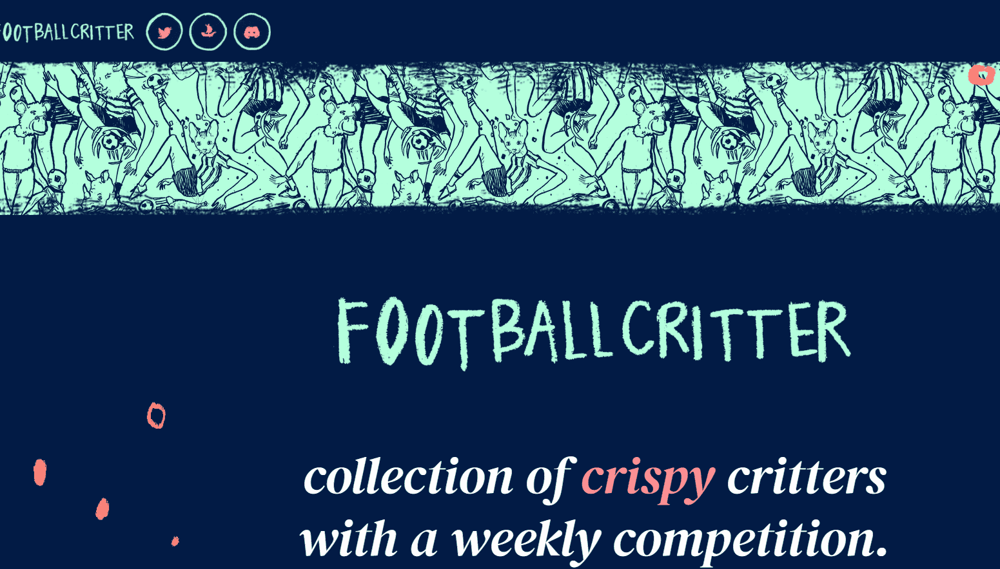

# footballcritter

为什么是足球？
在 footballcritter 中，足球是肤浅的。选择它有几个原因： 足球是世界性的运动。它是一种通用语言。Web3 是一次真正掌握一个行业的全球能力的第一个机会。在过去的 7 年里，Geoff 一直在创作基于足球的图像。所有这三者都结合到了 footballcritter 的首选“皮肤”中。

评分如何运作？
每个小动物在元数据中都有一个动物基地、一个位置和一个它所效力的“团队”。“团队”与现有的 NFT 项目相关。根据 NFT 项目在市场上的表现（ETH 变动、持有者的唯一数量、销售价格等）会影响个体生物的得分。用户有机会设置他们的阵容（守门员、后卫、中场和前锋）来创建自己的阵容。每周你的小队都会有一个独特的分数。

