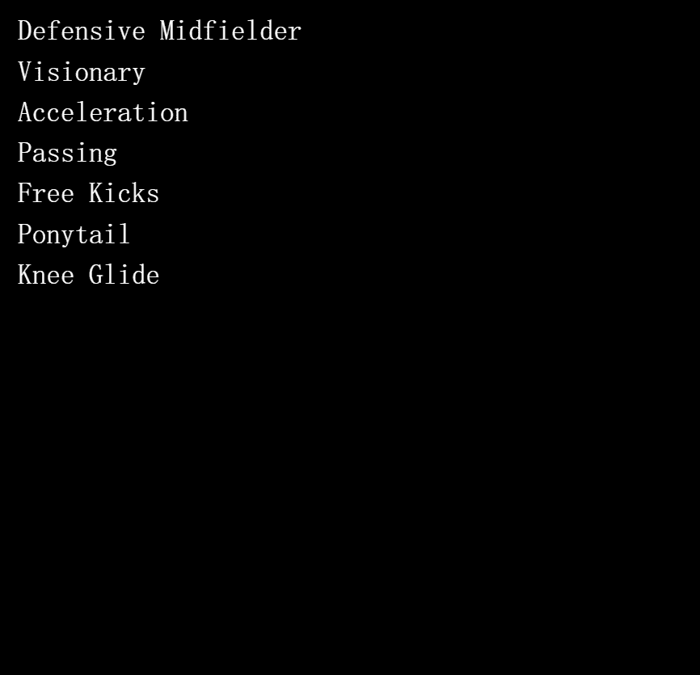
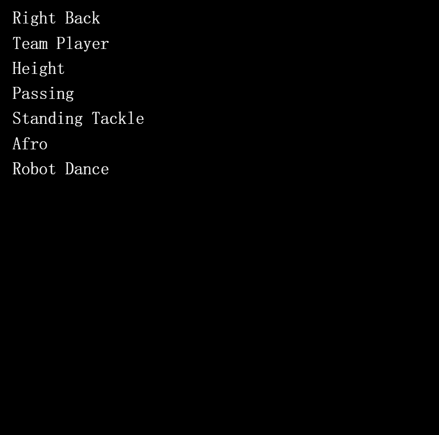
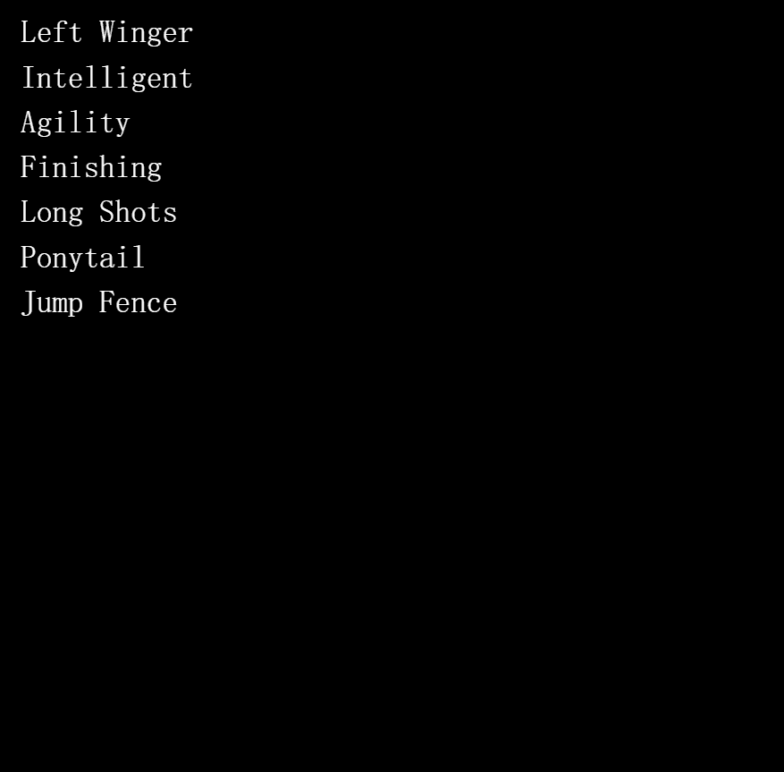

# FOOTYVERSE

项目网站、社交联系方式、项目介绍内容详见：https://opensea.io/collection/footy-verse

FootyVerse 是一个足球元宇宙。通过铸造你的球员，将你的足球基因赋予这个元宇宙。一旦您加入FootyVerse 社区，您就将您的足球基因赋予了这个元宇宙。你通过成为这个 Discord 的一部分，持有这个 Metaverse 中的一件物品，与这个 Metaverse 分享你对足球的想象并帮助扩展这个 Metaverse 来做到这一点。无论是物理世界还是数字世界，足球始于一名球员，他开始用足球训练。随着时间的推移，球员学会了如何传球、射门、铲球和许多其他技能。FootyVerse 的大爆炸正在发生，10,500 名足球运动员出生时具有不同的特征。每个球员本身都是独一无二的。您可以通过输入 1-10000 调用“声明”函数来声明任何玩家。确保该玩家尚未被认领。

