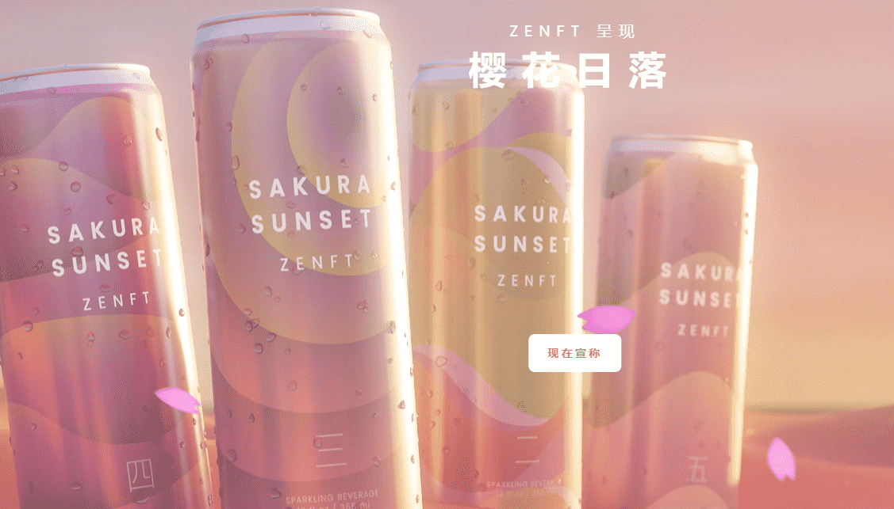

# Forest Spirits by ZENFT

介绍森林精灵：森林的祖孙和盆景的守护者。每个精神都从一个普遍的元素中汲取力量，激发其在生活中的作用。

Forest Spirits 是与 AR 兼容、支持 Metaverse 的 3D 化身，是 ZENFT Studio 的第二个主要系列。

该系列包括社区创作的艺术品、合作伙伴的合作，以及更多由 ZENFT 领导团队策划的作品。

领取您的免费收藏饮料！先到先得，送完为止Like，RT，并标记2位朋友进入，赢取森林精灵！

