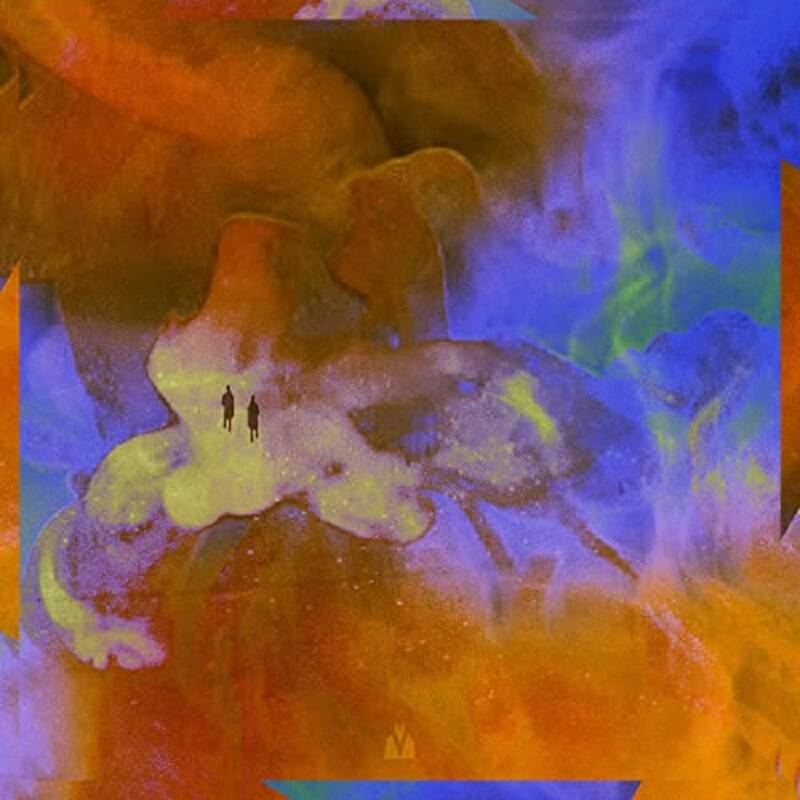
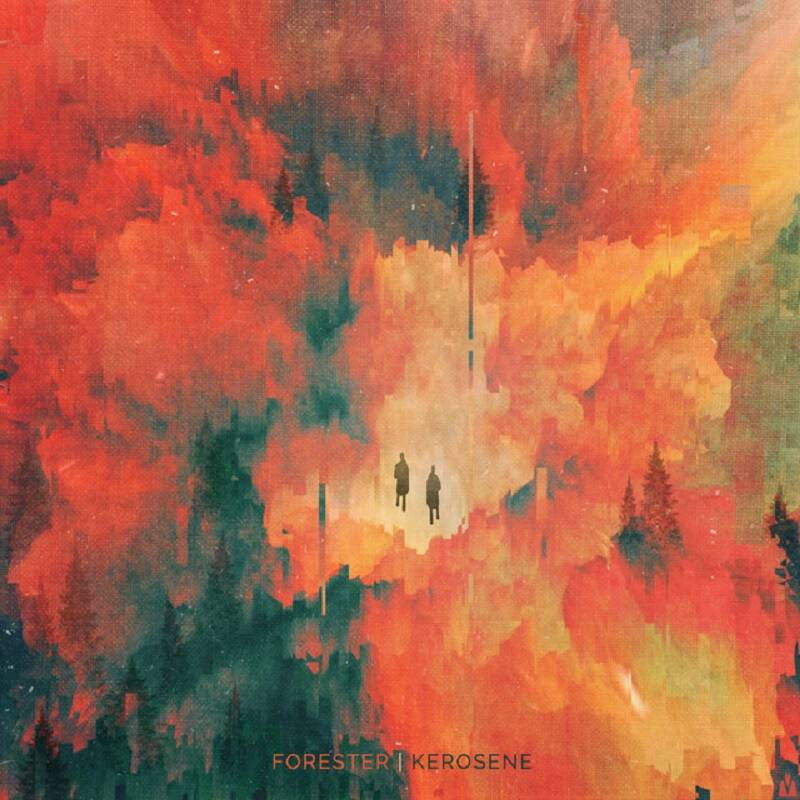
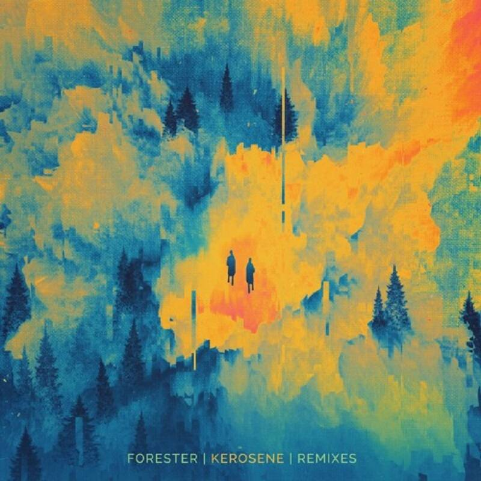

# Forester-Spark

项目网站、社交联系方式、项目介绍内容详见：https://opensea.io/collection/forester-spark

▶ 什么是 Forester-Spark？
Forester-Spark 是一个 NFT（不可替代令牌）集合。存储在区块链上的数字艺术品集合。
▶ 有多少 Forester-Spark 代币？
总共有 20 个 Forester-Spark NFT。目前，16 位车主的钱包中至少有一个 Forester-Spark NTF。
▶ 最近卖出了多少 Forester-Spark？
过去 30 天内售出 0 个 Forester-Spark NFT。

