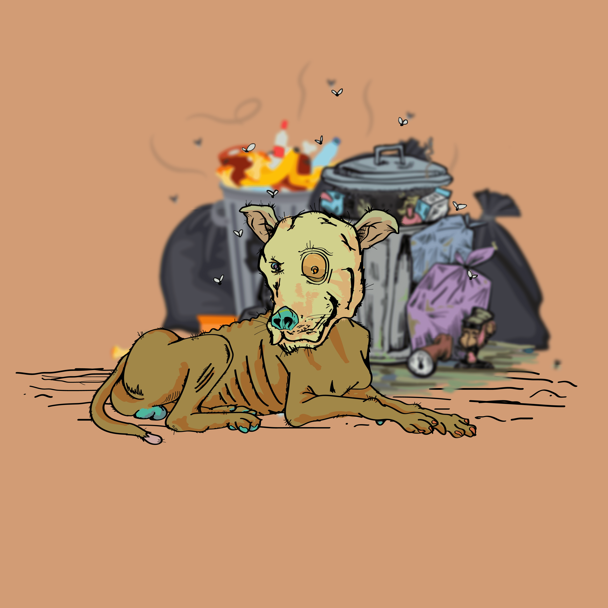
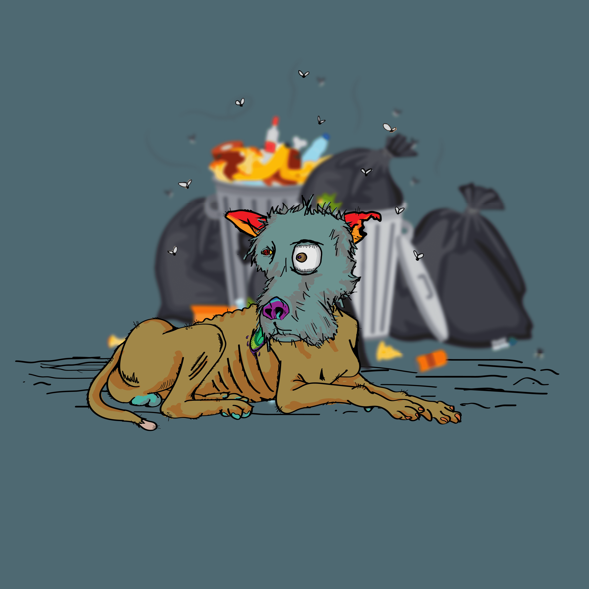
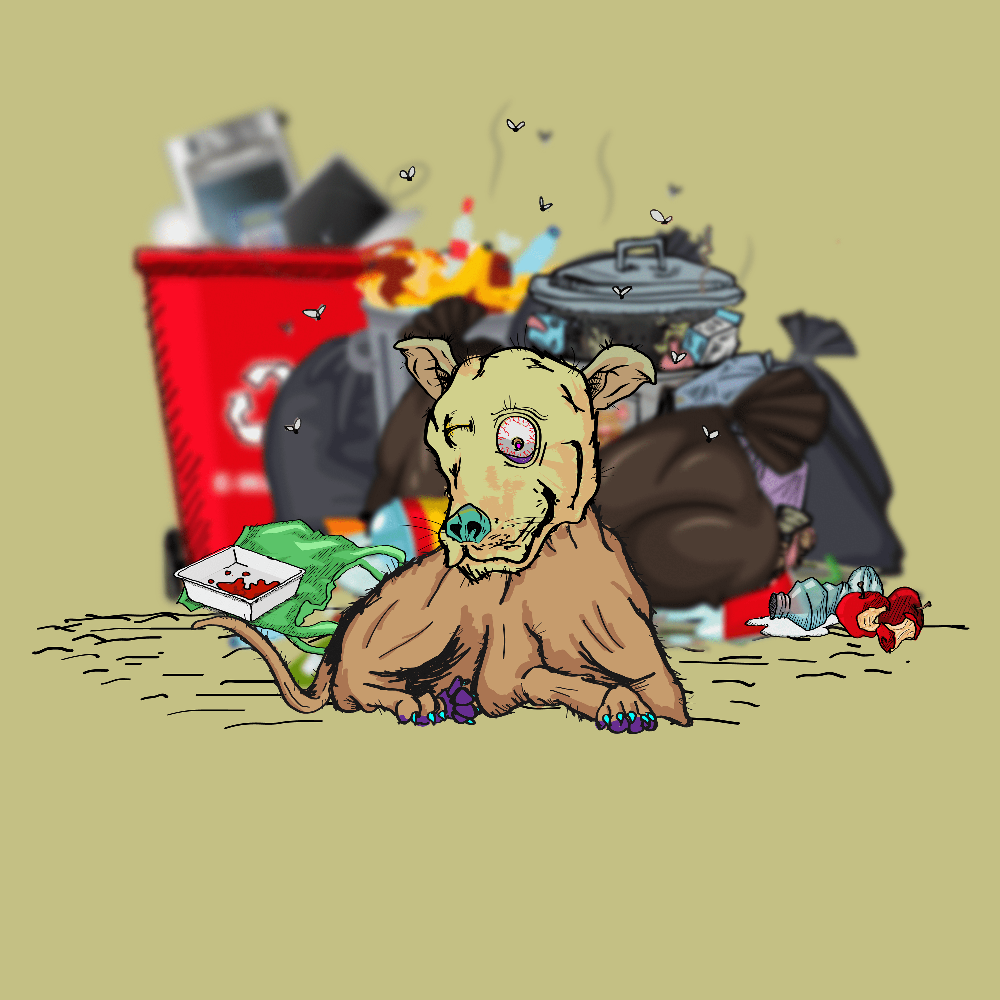

# forgottendog.wtf

项目网站、社交联系方式、项目介绍内容详见：https://opensea.io/collection/forgottendog-wtf

  什么是遗忘狗.wtf？
forgetdog.wtf 是一个 NFT（非同质代币）集合。存储在区块链上的数字艺术品集合。
 有多少个被遗忘的dog.wtf 代币？
总共有 9,990 个被遗忘的dog.wtf NFT。目前 1,459 位所有者的钱包中至少有一个 forgetdog.wtf NTF。
 最昂贵的遗忘狗.wtf 销售是什么？
最昂贵的被遗忘的dog.wtf NFT 是 被遗忘的狗。它于 2022-06-17（2 个月前）以 38.4 美元的价格售出。
 最近被遗忘的dog.wtf 卖了多少？
过去 30 天内售出了 18 个被遗忘的dog.wtf NFT。
 一个被遗忘的狗.wtf 需要多少钱？
在过去 30 天内，最便宜的 forgetdog.wtf NFT 销售额低于 1 美元，最高销售额超过 9 美元。在过去 30 天内，forgotdog.wtf NFT 的中位价格为 1 美元。
 什么是流行的遗忘狗.wtf 替代品？
许多拥有 forgetdog.wtf NFT 的用户还拥有 Baby Ape Yacht Club TP、 Satonis、 Baby Chimp和 PIXMON-THE PIXEL MONKEY。

