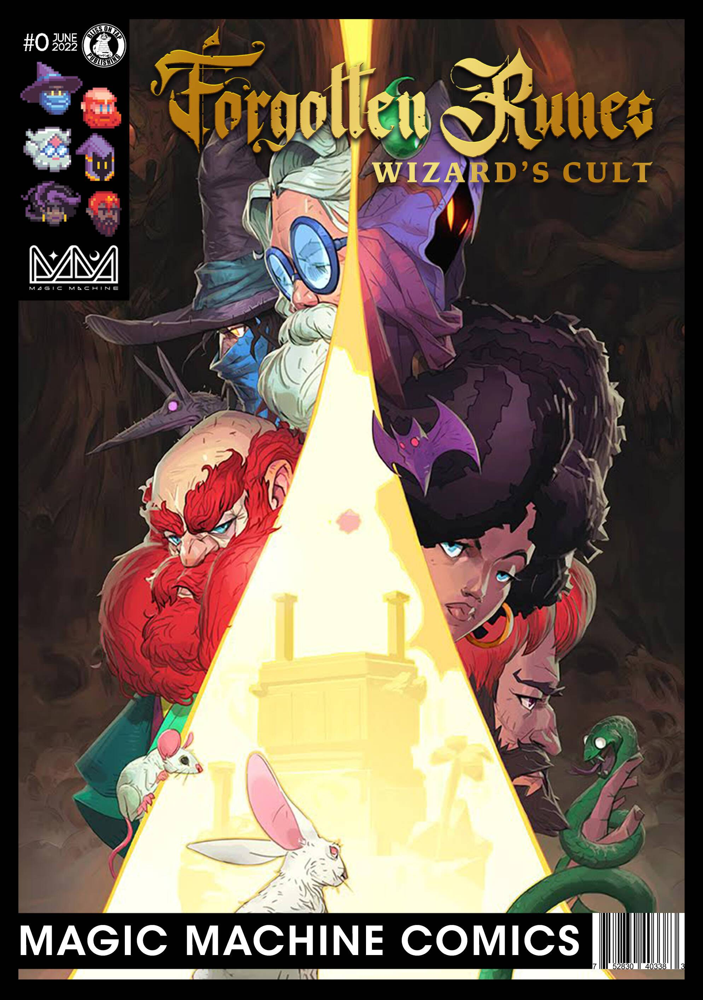
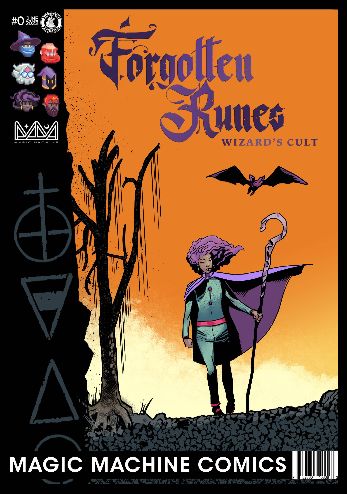
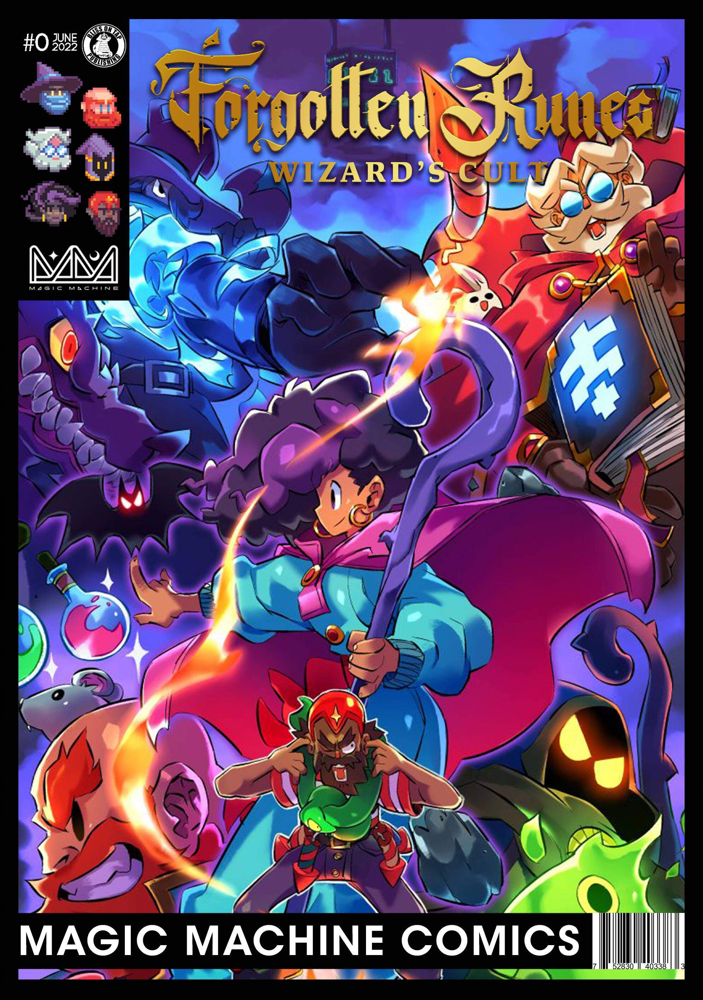

# Forgotten Runes Comics

项目网站、社交联系方式、项目介绍内容详见：https://opensea.io/collection/forgottenrunescomics

Forgotten Runes Wizard's Cult 是 10k Wizard NFT 的集合。这些巫师是我们不断发展的社区的核心，被亲切地称为邪教。
每天，我们的 Cult 成员都会为社交媒体和我们独一无二的传说书贡献艺术、动画、故事、模因和传说。邪教创造的越多，符文宇宙就越大。正如我们所说，“知识是核心。”

这种去中心化的世界构建方法就是我们所说的“协作传奇”，我们相信它具有无限的潜力。
首先，加入邪教意味着您将被允许参与我们的去中心化世界建设的宏伟实验。这是一种建立 IP 特许经营权的革命性方法，在区块链技术出现之前，这从未真正成为可能。Runiverse Legendarium 的目标是比中土世界、维斯特洛和霍格沃茨的总和还要大，因为它是由整个 Cult 成员社区建造的，而不是由一个权威机构建造的。

此外，拥有 Wizard NFT 可以让您获得许多其他宝藏和惊喜。我们的 NFT 远不止是静态图像，它们还活着！例如，您可以在World Wide Webb 3等元节中使用完全动画的步行循环进行遍历。您可以通过我们的 Twitter 向您的朋友宣布“GM”通用发电机。您会定期收到诸如Sacred Flame和Ponies等免费空投的惊喜！被遗忘的符文开发者总是让邪教大吃一惊。加入我们一起享受乐趣吧！

