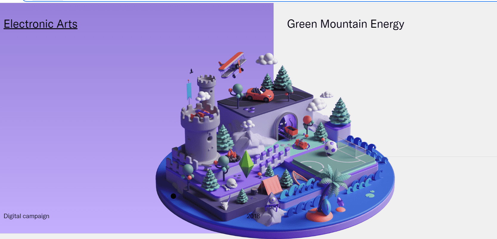

# Forms + Shapes

专注于 3D 的艺术家和艺术总监Peter Tarka 使用形式、形状和大胆的色彩制作身临其境的插图。

以提升地球上最知名品牌的美感。作为一位成熟的艺术家和艺术总监。

彼得能够创造出令人着迷的视觉体验。

戛纳银狮 - 艺术指导与设计戛纳铜狮 - 社交平台的使用铜立方 - ADC 奖入围 - ADC 奖银色 KTR - 插图青铜 KTR - 插图 彼得塔卡的形式+形状。

