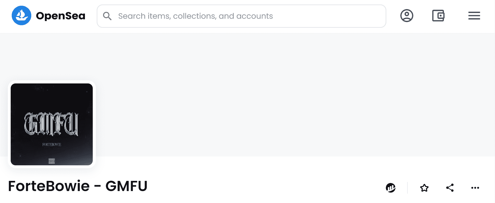

# ForteBowie - GMFU

我说“我很好”我是 Gucci Mane，“我说，”我很直我说，“我很好，我是 Gucci Mane，”我说，“我很直，我是 Gucci Mane，你伤了我的心，我再也不会爱了，你伤了我的心，我”永远不会像以前一样生活，不”在南方（与其他地方差不多），“我是 Gucci”是“我很好”或“我做得很好”的另一个术语。Young Forte 巧妙地使用了流行说唱歌手的名字来表示他很好，尽管这首歌的主题显然不是这样。Forte 因失去爱人而受到伤害，这是贯穿他音乐的主题，他利用这个平台不仅要度过难关，还要表达他的感受。

