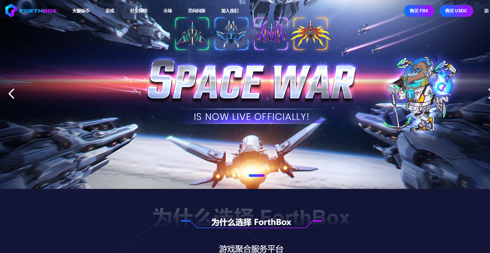

# ForthBox Meta Box NFT

ForthBox 团队拥有超过 20 名游戏开发者，计划分阶段推出 15 款优质区块链游戏，从 STG 到 EDU。此外，ForthBox基金会已孵化超过100款区块链游戏，同时与多家上市游戏公司进行交流，准备推出多款优质第三方游戏。Space War是ForthBox平台自主研发的第一款太空元宇宙游戏。有着气势磅礴的太空战斗场面。玩家将驾驶战舰与各个星球作战，拯救潘多拉。此外，Space War还支持星球拍卖、卫星基站建设等NFT游戏。

Ham 是一种平台 NFT 资产，可以用少量的 gas 来免费铸造。初始等级为1-0，算力为1。当我们用食物（代币）喂Ham时，它开始有算力，可以分享挖矿红利。火腿 NFT 也是玩家进入《阿凡达》元宇宙的钥匙和潘多拉之旅的门票。

