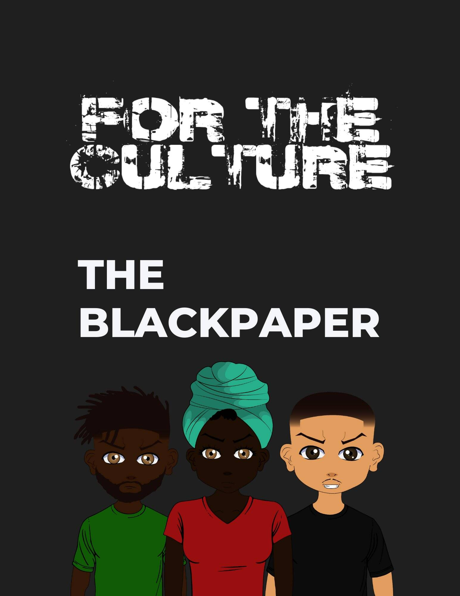

# For The Culturez

项目网站、社交联系方式、项目介绍内容详见：https://opensea.io/collection/fortheculturez

For The Culture 的独特之处在于我们专门针对非洲侨民设计了我们的项目，有 9 种不同色调的黑色素，我们希望每个收藏家都能找到与他们产生共鸣或相似的 PFP。通过用 T 恤设计我们的头像，我们能够降低初始铸造价格，让更多的首次收藏家获得机会，同时也让他们有机会在未来“换衣服”，以进一步根据个人个性定制头像。 
For The Culture 旨在激发更多主流采用 NFT 空间。就像一开始早期采用加密货币一样，直到越来越多的人投资，我们才看到我们在 2021 年看到的价值增长量。进入 NFT 领域的采用者越多，它就越有弹性和稳定性将会。 
NFT 的伟大之处在于，您现在不仅可以投资硬币并等待价值增加，还可以欣赏、欣赏和展示数字艺术品，而该艺术品可能会升值。 
我们计划与 IRL（在现实生活中）品牌和社会影响者建立未来的合作伙伴关系，我们的目标是建立一个多元化且有吸引力的社区，成员可以在其中了解其他 NFT 项目以及整个加密货币的未来。
这只是加密货币、元宇宙和 For The Culture 的开始。

