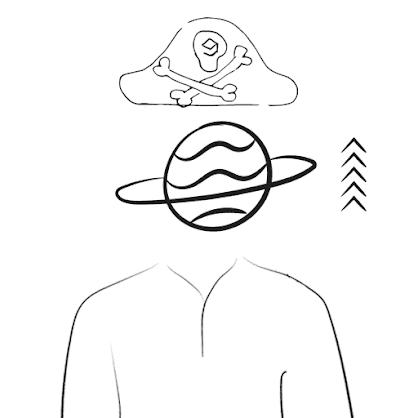

# For The Peace

项目网站、社交联系方式、项目介绍内容详见：https://opensea.io/collection/forthepeace

为了和平，2222和平的艺术品传播爱。

什么是为了和平？

For The Peace 是一个 NFT（非同质代币）集合。存储在区块链上的数字艺术品集合。

有多少 For The Peace 代币？

总共有 2,222 个 For The Peace NFT。目前，1,024 位车主的钱包中至少有一个 For The Peace NTF。

For The Peace 拍卖中最贵的是什么？

最昂贵的 For The Peace NFT 是 [For The Peace #1172](https://www.nft-stats.com/asset/0xdcd8b9099d4f41d65821accf00fefcc4642dd39c/1171)。它于 2022-06-13（2 个月前）以 15.2 美元的价格售出。

