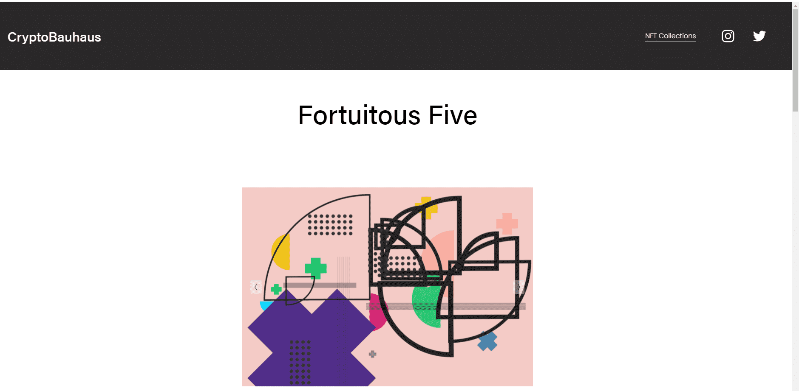

# Fortuitous Five

“幸运五人”是一个有限的生成艺术收藏品，由 50 件独特的作品组成。偶然被定义为“碰巧发生；幸运。” 这个系列的希望是，通过利用简单的视觉元素和利用随机数的算法，每件作品都将偶然创造出视觉上引人注目的作品。

每件作品都以 5 种不同的视觉元素开始，包括半圆、四分之一圆轮廓、多个点、多条线和一个加号。使用生成一系列随机数的算法，每个元素都被复制、放置在画布上并根据这些随机数进行缩放。有五种可能的配色方案，Edgewater、Coral Candy、Wild Rice、Biloba Flower 和 Wild Sand。Wild Sand 有 5% 的几率发生。

原始所有者将在购买时获得免费的 8.5x11 打印。将您的地址 DM 给我以接收您的打印件。

