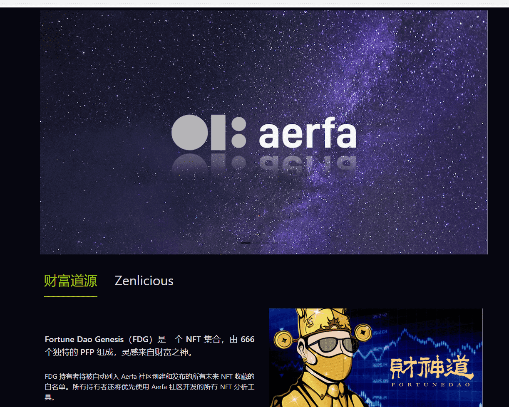

# Fortune Dao Genesis

Fortune Dao Genesis（FDG）是一个 NFT 集合，由 666 个独特的 PFP 组成，灵感来自财富之神。FDG 持有者将被自动列入 Aerfa 社区创建和发布的所有未来 NFT 收藏的白名单。

所有持有者还将优先使用 Aerfa 社区开发的所有 NFT 分析工具。由 NFT Aerfa 社区的思想产生，具有 PFP、会员和工具箱访问的协同效用。

该系列由 666 件艺术作品组成，灵感来自财富之神，并带有现代时尚宣言。每件作品都有自己的特点和稀有性，最终将被编程为反应式 NFT，通过改变面部表情不断监控和响应 NFT 市场。

