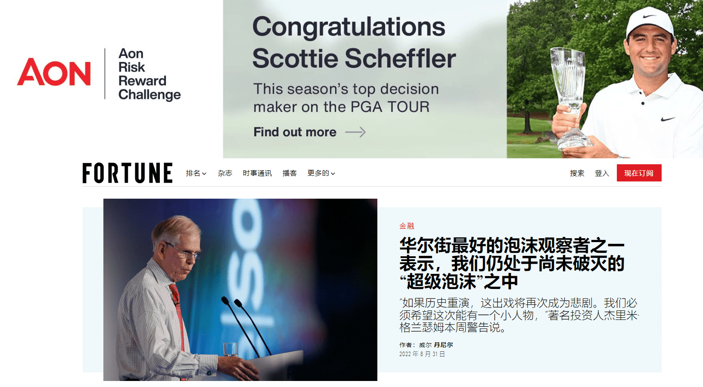

# Fortune Media

华尔街最好的泡沫观察者之一表示，我们仍处于尚未破灭的“超级泡沫”之中“如果历史重演，这出戏将再次成为悲剧。我们必须希望这次能有一个小人物，”著名投资人杰里米·格兰瑟姆本周警告说。

财富推动了关于商业的对话。我们以全球视野、历史指导智慧和对未来坚定不移的眼光，报道和揭示今天重要的故事——明天将更加重要。

对于它的八月/九月。2021 年的主题是“加密货币与华尔街”，《财富》与定义“去中心化金融”运动美学的艺术家 pppleasr 合作。《财富》杂志正在制作 256 版动画封面艺术作为 NFT——这个数字与比特币和以太币等加密货币核心的 256 位加密密钥一致。

Fortune 和 ppplpleasr 还与 Manifold 合作，为三个特别版 NFT 定制智能合约。如果选择的加密影响者钱包中的一个出价最高，则图形将更改为显示其头像或徽标。

pppleasr 说她的作品代表了 DeFi 的个性和潜力：“它是一个完整的多彩、充满活力的生态系统和社区，而不仅仅是一个投资平台”

