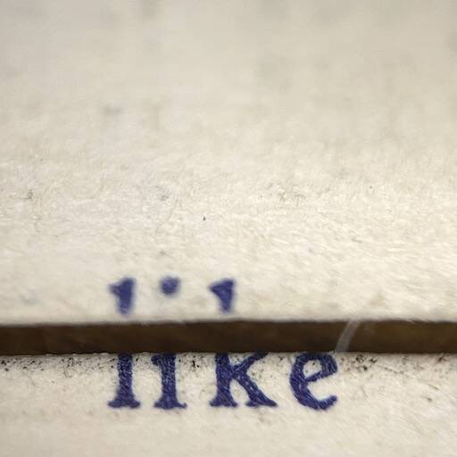
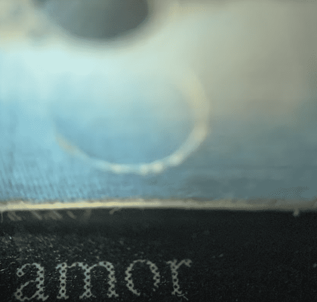

# Four Letter Words Genesis

项目网站、社交联系方式、项目介绍内容详见：https://opensea.io/collection/four-letter-words-genesis

这个 NFT 合集是给印刷词的一封热气腾腾的情书，由电影制作人和童年脏话收藏家 Brett Simon 拍摄的一系列 666 张独特的四字母单词照片

这些 NFT 是对坏词和好词的庆祝，是印刷词与新数字媒体之间的对话，是词所有者社区的创建。每个单词在集合中只出现一次。你和你一个人可以拥有*爱……*或者*他妈的。*如果您有幸获得了 100 多个“脏”字中的一个，您将能够免费获得一个奖金四字母字。

