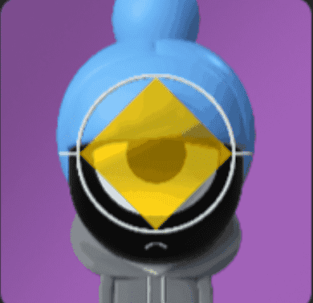

# Four Farcels

项目网站、社交联系方式、项目介绍内容详见：https://opensea.io/collection/fourfarcels

Four Farcels 是来自 Farcel Fisapppoints 世界的 444 位有情绪的朋友的集合。Pixeled Farcels 是个人和独特的。每个 Farcel 都是一个存在于以太坊区块链上的 NFT。不隶属于 Dour Darcels。  Etherscan 是以太坊的领先区块链浏览器、搜索、API 和分析平台，以太坊是一个去中心化的智能合约平台。它于 2015 年建成并启动，是围绕以太坊及其社区构建的最早和运行时间最长的独立项目之一，其使命是提供对区块链数据的公平访问。

