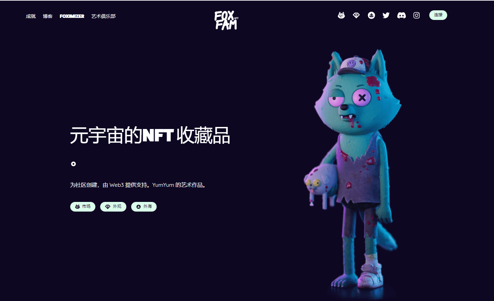

# FoxFam

Fox Fam 是由 Yum Yum Studio 设计的生成角色集合。这些狐狸是由一组精心制作的属性制成的，赋予每只狐狸自己独特的性格。我们已将 10,000 只狐狸放归野外供您拥有！

我们正在制作 CGI、完全纹理化、装配好的动画化身来陪伴每只 2D 创世纪狐狸。

这些资产由经验丰富的行业专业人士精心打造。这个团队喜欢创造 3D 角色，并且在对细节和工作质量的关注上闪耀着思想。

除了高产值的 3D PFP，我们的目标是发布优化的交互式可下载装备，为 Metaverse 做好准备，并用于围绕创建和构建您自己的 IP 品牌。优化后的版本可用于增强现实、游戏、3D 打印和其他有趣的用例。3D fam 是项目 CGI 子部分的基础，我们将这些资产视为我们希望提供的未来实用程序的基础。

3D Fam 是可通过我们新的奖励系统获得的众多资产之一。奖励可以通过奖励参与项目的各种方式获得。如果您拥有一只或多只 2D Genesis Fox，请在此处查看，因为您可能已经有资格获得奖励！

虽然每个 2D Genesis Fox 都有一个 3D 副本，但它们不仅仅是直接克隆。3D 系列的美学得到增强，借此机会扩大 FoxFam 的世界并最大限度地发挥媒体的潜力。我们认为每个狐狸主人都会喜欢他们的 3D NFT。

