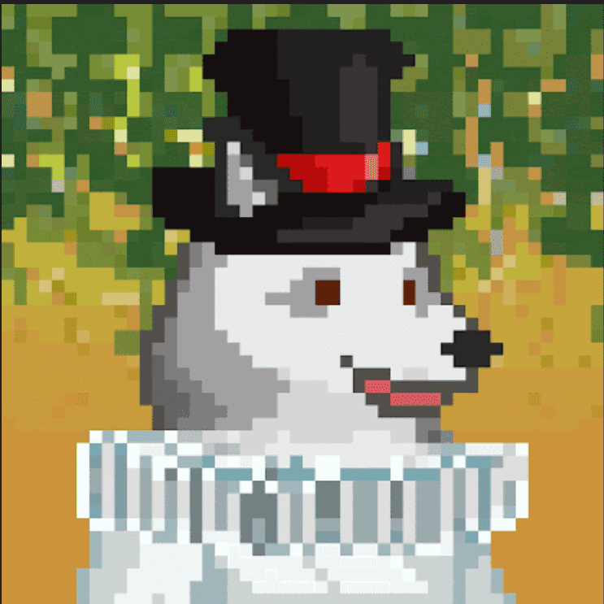

# FoxPunk Jrs

项目网站、社交联系方式、项目介绍内容详见：https://opensea.io/collection/foxpunk-jrs

更多可爱的 ERC721 狐狸生活在以太链上！这些非常可爱的狐狸是起源红狐的后代！他们比他们的父母更可爱（也更疯狂）！因为没有人能忍受他们父母的可爱。所以他们的孩子有 6 种不同的物种（是的，我知道，非常令人印象深刻，对吧？）。耳廓狐、北极狐、蝙蝠耳狐、大理石狐、银狐和白狐！收养在这里进行!

