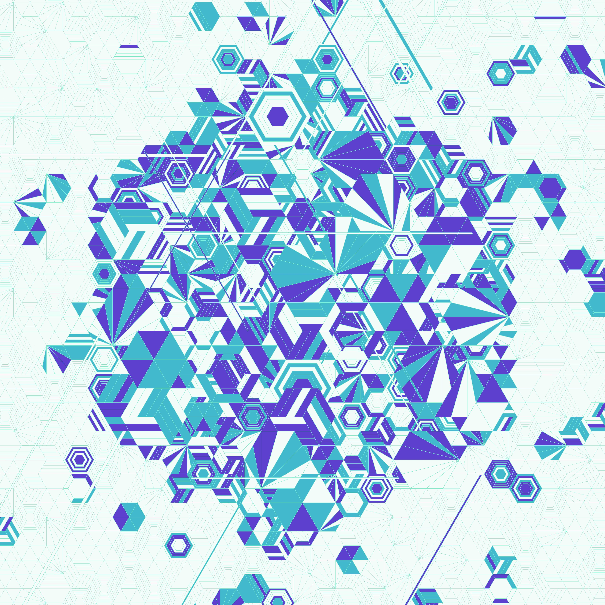

# Fractured Cells

项目网站、社交联系方式、项目介绍内容详见：https://opensea.io/collection/fractured-cells

从你的细胞中突围

释放自己。别再盯着电视了。停止滚动社交媒体。读一本书。开始您一直在考虑的业务。拿起你放弃的乐器。学习那种新语言。画一些东西，任何东西。删除食物应用程序并从头开始为自己做一些新的东西。和那个老朋友谈谈。告诉那个人你喜欢他们。停止吸烟。拥抱你的妈妈。停止与您的朋友和邻居竞争。停止购买你不需要的东西，因为你真的买不起。这是一个陷阱。

不要再认为好事只会发生在“幸运”的人身上。你自己造运气。不要坐在那里等待成功落入你的怀抱。使其发生。成为自己命运的作者。上那门课。发送该电子邮件。不要轻易放弃，认真的。只有放弃，你才会真正失败。你会对你能取得的成就感到惊讶。

