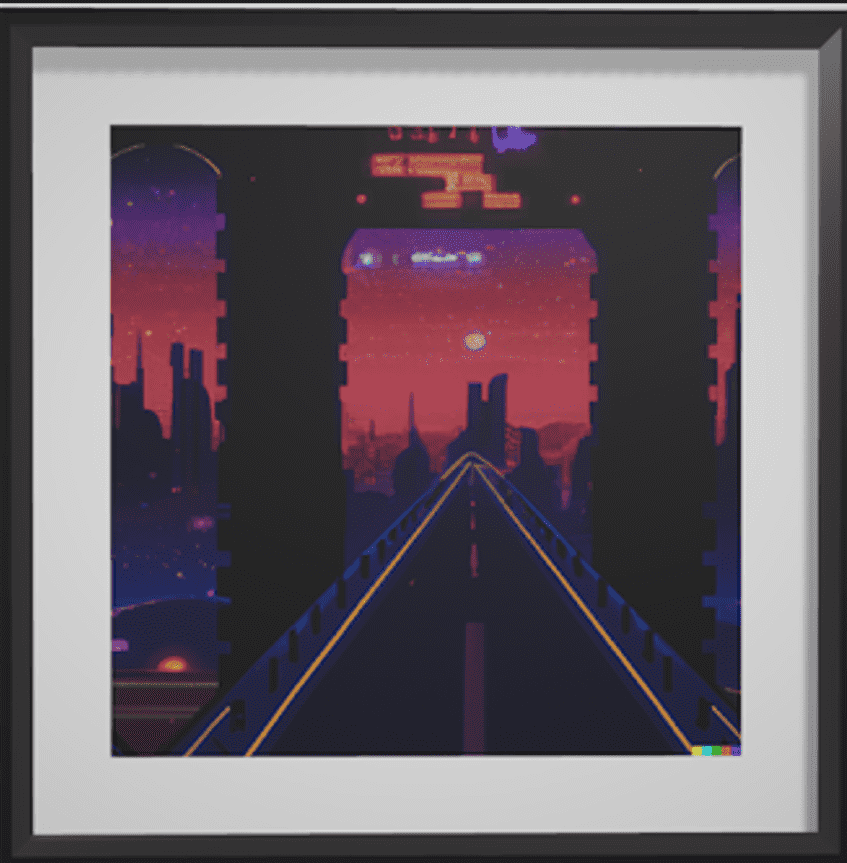

# Framed AI Art

项目网站、社交联系方式、项目介绍内容详见：https://opensea.io/collection/framed-ai-art

这是DALL·E 2创作的原创AI生成艺术作品。

DALL·E 2 是一个人工智能系统，可以根据自然语言的描述创建逼真的图像和艺术。

DALL·E 2 帮助我们了解先进的人工智能系统如何看待和理解我们的世界，这对于我们创造造福人类的人工智能的使命至关重要。

此 NFT 是一个 3D 对象，可以导入到诸如 Spatial 之类的 Metaverse 应用程序以及其他兼容的应用程序中。

该 NFT 销售所得利润的 10% 用于 PhygiEd 程序。PhygiEd 研讨会和教育资源旨在为不同的受众提供 Web3 和元宇宙中的公平机会。

