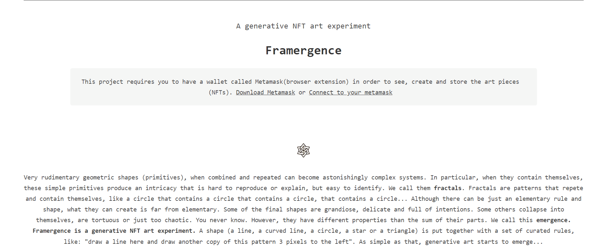

# Framergence

项目网站、社交联系方式、项目介绍内容详见：

非常基本的几何形状（基元），当组合和重复时，可以成为惊人的复杂系统。特别是，当它们包含自己时，这些简单的原语会产生一种难以复制或解释但易于识别的复杂性。我们称它们为**分形**。分形是重复和包含自己的图案，就像一个圆圈包含一个圆圈，一个圆圈包含一个圆圈，一个圆圈包含一个圆圈......虽然可能只有一个基本的规则和形状，但它们可以创造的远非基本。一些最终的形状是宏伟的、精致的和充满意图的。其他一些人会陷入自己的困境，曲折或太混乱。你永远不会知道。但是，它们具有不同于它们各部分之和的特性。我们称之为出现。Framergence 是一个生成式 NFT 艺术实验。一个形状（一条线、一条曲线、一个圆形、一个星形或一个三角形）与一组精心设计的规则组合在一起，例如：“在此处画一条线，并在左侧 3 个像素处绘制此图案的另一个副本”。就这么简单，生成艺术开始出现……

