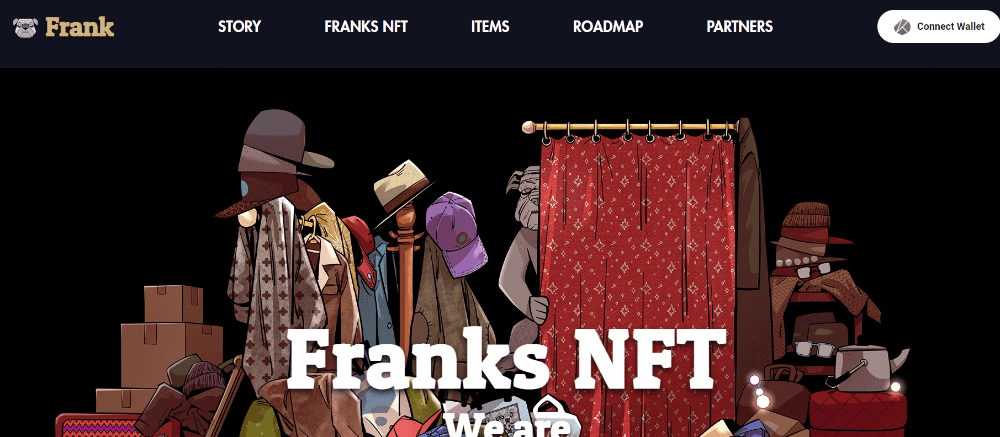

# Franks NFT

项目网站、社交联系方式、项目介绍内容详见：

弗兰克是一只热爱时尚的斗牛犬。他可以穿你独特选择的物品。现在享受他的定制时尚。

唯一且随机生成的 NFT。
随机生成 10,000 种卡通风格。
基于项目的 Klaytn(Klay)。

特别的牛头犬，佛兰德。出生于18世纪，不知道什么原因获得了永生，至今还活着的神秘斗犬。Frank，经过漫长的岁月，他终于用双脚走路，也穿上了衣服。

