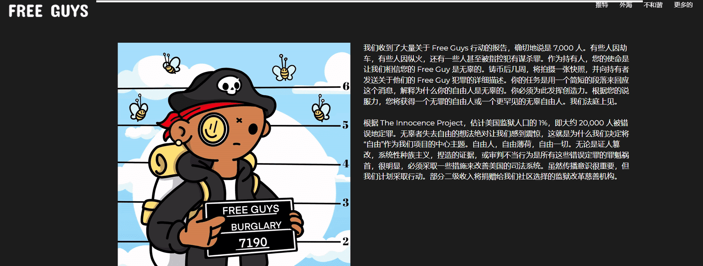

# Free Guys Official

我们收到了大量关于 Free Guys 行动的报告，确切地说是 7,000 人。有些人因劫车，有些人因纵火，还有一些人甚至被指控犯有谋杀罪。作为持有人，您的使命是让我们相信您的 Free Guy 是无辜的。铸币后几周，将拍摄一张快照，并向持有者发送关于他们的 Free Guy 犯罪的详细描述。你的任务是用一个简短的段落来回应这个消息，解释为什么你的自由人是无辜的。你必须为此发挥创造力。根据您的说服力，您将能够声称一个有罪的自由人或一个更罕见的无辜自由人。我们法庭上见。

根据 The Innocence Project，估计美国监狱人口的 1%，即大约 20,000 人被错误地定罪。无辜者失去自由的想法绝对让我们感到震惊，这就是为什么我们决定将“自由”作为我们项目的中心主题。自由人，自由薄荷，自由一切。无论是证人篡改，系统性种族主义，捏造的证据，或审判不当行为是所有这些错误定罪的罪魁祸首，很明显，必须采取一些措施来改善美国的司法系统。虽然传播意识很重要，但我们计划采取行动。部分二级收入将捐赠给我们社区选择的监狱改革慈善机构。

