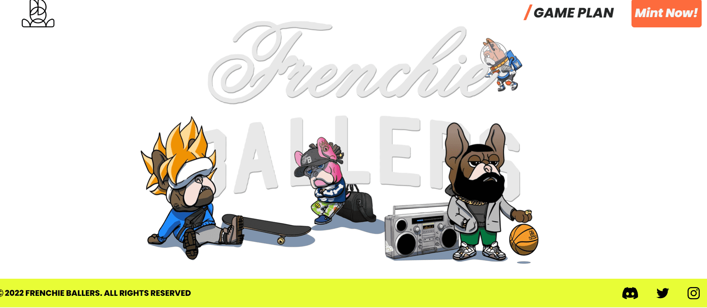

# Frenchie Ballers Official

项目网站、社交联系方式、项目介绍内容详见

由 Vans、Puma Street 和 Apple 的插画师 Tim Mele 创作的 5,555 个 NFT 收藏。该系列让您可以通过完全构建的游戏和更多正在开发的游戏来访问 Ballerverse。赌注和游戏让您可以赚取 $ 饼干，这些饼干为 Balleverse 提供动力，并且可以在他们的市场上用于获取超级碗门票、现实生活收藏品、WL Spots 和 NFT 之类的东西。该团队由首席开发人员 Todd Albert 和他的团队、Kendrick Perkins NBA 冠军和 ESPN 分析师以及 web3 Degens 团队组成。

