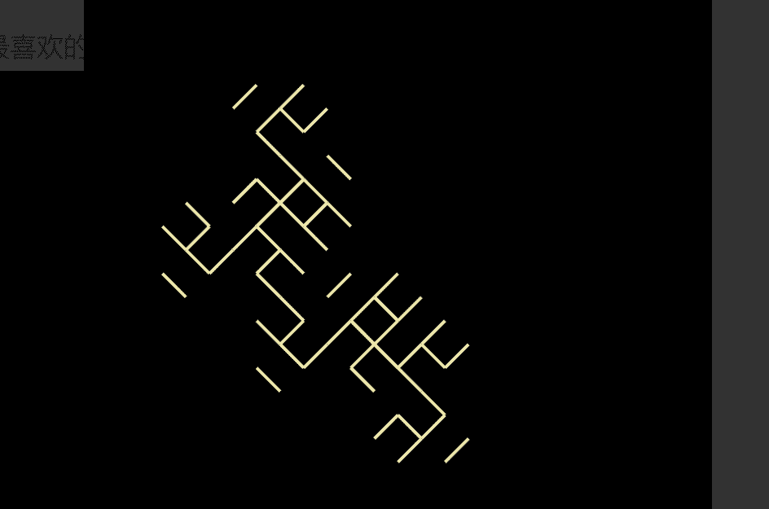

# Friendly Fractals N

项目网站、社交联系方式、项目介绍内容详见：

欢迎来到 OpenSea 上的 Friendly Fractals N 之家。发现这个系列中最好的项目。

 Friendly Fractals N是一个 NFT（不可替代代币）集合。存储在区块链上的数字艺术品集合。总共有 98 个友好分形 NFT。目前，76 位所有者的钱包中至少有一个 Friendly Fractals N  过去 30 天内售出 0 个 Friendly   Fractals N

