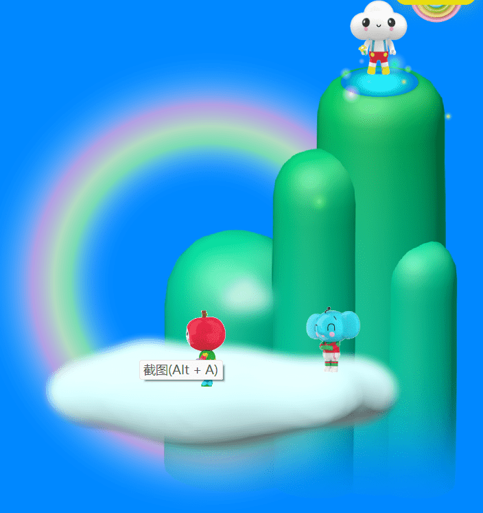

# fRiENDSiES

项目网站、社交联系方式、项目介绍内容详见：https://opensea.io/collection/friendsies-nft

# 欢迎来到花园！

朋友是你永远的朋友。您的新数字伴侣并融入善意社区，即花园。这个 10,000 个 NFT 的集合是由 FriendsWithYou 用爱心制作和设计的。从数百种角色组合中进行选择，包括自定义头部、身体、豆芽、手持物品、尾巴等等！这些特征包含数十种特殊的 1/1 和极其稀有的属性可供收集。每个朋友都是由收藏家在铸币期间与我们独一无二的 NFT 建造者 FRENGEN 一起定制的。整个系列将由我们的社区同时构建和策划。

FriendSiES 世界从生成您的朋友开始，并将扩展到虚拟世界、现实生活体验和艺术装置、限量版物品，并最终创建一个 AR AI 伴侣，这将有助于为其持有者及其社区带来欢乐。

Friends 将从一开始就与社区建立伙伴关系。在我们通过即将公布的社区金库、路线图和特许权使用费计划与社区合作发展品牌的过程中，拥有朋友将让您有发言权。

