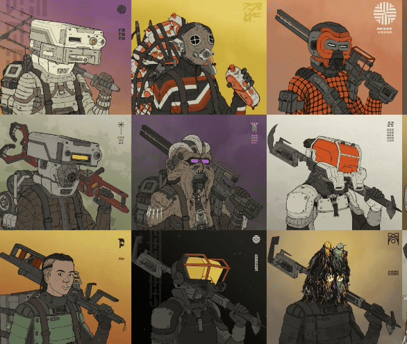
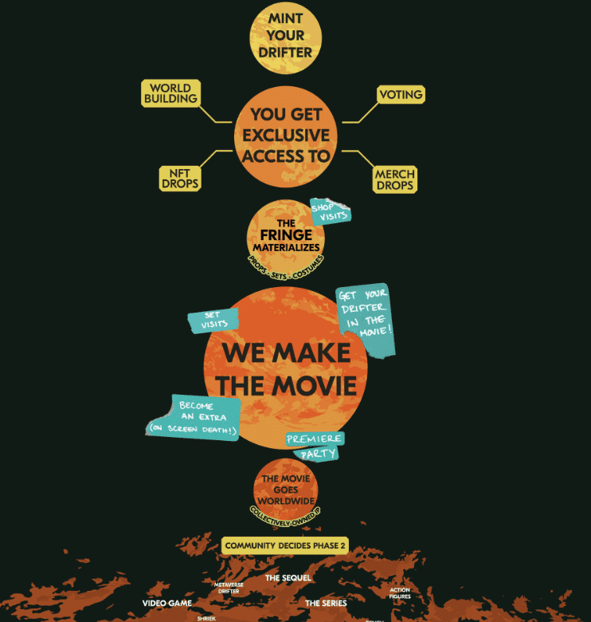

# Fringe Drifters

项目网站、社交联系方式、项目介绍内容详见：https://opensea.io/collection/fringe-drifters

# 边缘漂泊者

*分享*

*more_horiz*

欢迎来到边缘。

The Fringe 是一个由电影《展望》的创作者创立的新宇宙。

共有 9,494 名漂流者。流浪者存在于边缘的四个目的地。该系列将一次铸造一个目的地。每个目的地都将具有独特的品质和故事情节。第一个造币厂将释放 1,499 名来自 Scablands 的漂流者。

它从 NFTS 开始。然后我们拍电影。持有者在整个过程中构建和投票

![漂流者#0791](https://lh3.googleusercontent.com/nwd6EayZWUQliG9tYg_Ml0kxhxNehjI2WWfbmZBuPz3nRyZJ_Cfg5AZJ9iTuc3BbuLwiwW8GQRl7nud1B0YOO62gfJro9jzPkbJ-5dQ=w418

