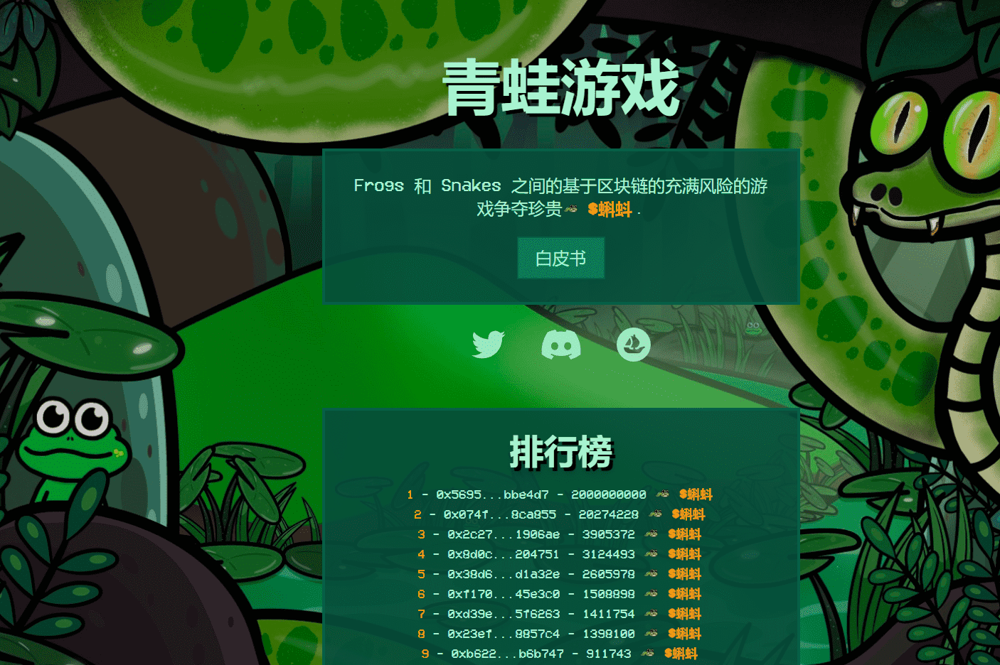

# Frog Game

什么是青蛙游戏 GEN 0？

Frog Game GEN 0 是一个 NFT（Non-fungible token）集合。存储在区块链上的数字艺术品集合。

Frog Game GEN 0 代币有多少？

总共有 3,000 个 Frog Game GEN 0 NFT。目前 428 位所有者的钱包中至少有一个 Frog Game GEN 0 NTF。

最昂贵的 Frog Game GEN 0 销售是什么？

最昂贵的 Frog Game GEN 0 NFT 是 [Frog #2484](https://www.nft-stats.com/asset/0x1880a647cfa183033995694e4b2edfc47b5f605f/2484)。它于 2022-06-07（3 个月前）以 16.3 美元的价格售出。

 最近卖出了多少 Frog Game GEN 0？

过去 30 天内售出了 3 个 Frog Game GEN 0 NFT。

