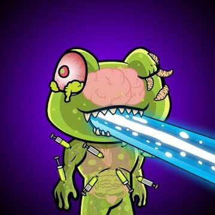
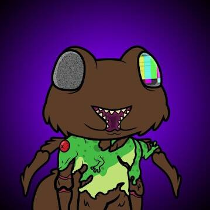
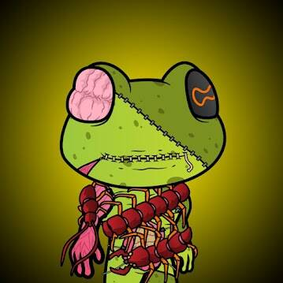

# Frog Mutants Club

项目网站、社交联系方式、项目介绍内容详见：https://opensea.io/collection/frogmutantsclub

FrogMutants 的产卵非常有限，只有在注入 Mutant-Vial 时才能产生。据说导致这种令人震惊的转变的血清是从外星物种传下来的。

▶ 什么是青蛙变种人俱乐部？
Frog Mutants Club 是一个 NFT（非同质代币）集合。存储在区块链上的数字艺术品集合。
▶ Frog Mutants Club 代币有多少？
总共有 888 个 Frog Mutants Club NFT。目前，63 位所有者的钱包中至少有一个 Frog Mutants Club NTF。
▶ 最近卖出了多少 Frog Mutants Club？
过去 30 天内售出 0 个 Frog Mutants Club NFT。
▶ 什么是流行的 Frog Mutants Club 替代品？
许多拥有 Frog Mutants Club NFT 的用户还拥有 Baby Yoda Grogu Official、 Dedsh Mutants Ape、 City Crazy Bears和 Skeletons Death。

