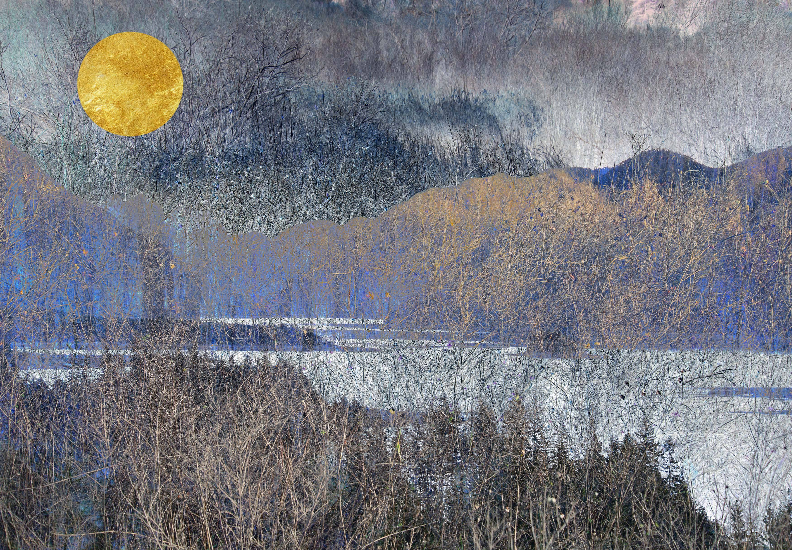

# From the Mountains of My Mind // By KRCaptures

从我心中的高山，从深海到漆黑的天空，我是怎么走到这一步的？



这些带纹理的风景是使用数字分层的照片创建的。每个都从以山脉为特色的景观的基础层开始。顶部放置一个金色圆盘，点缀场景，增加敬畏感。作为一名摄影师，我经常感到无法真正表现出大自然的威严。尤其是在山的存在时，我感受到的压倒性的宁静感。

这个系列是一种燃烧的创造力的产物，它不断地推动我寻找新的方式来使用摄影来表现我无法客观记录的东西。受到真实表达我在这些看似超现实的自然景观中所体验到的感受的渴望的启发，我为您带来了来自我心灵山脉的图像。我希望通过观看这些作品，你也能感受到敬畏、惊奇和深深的平静。

