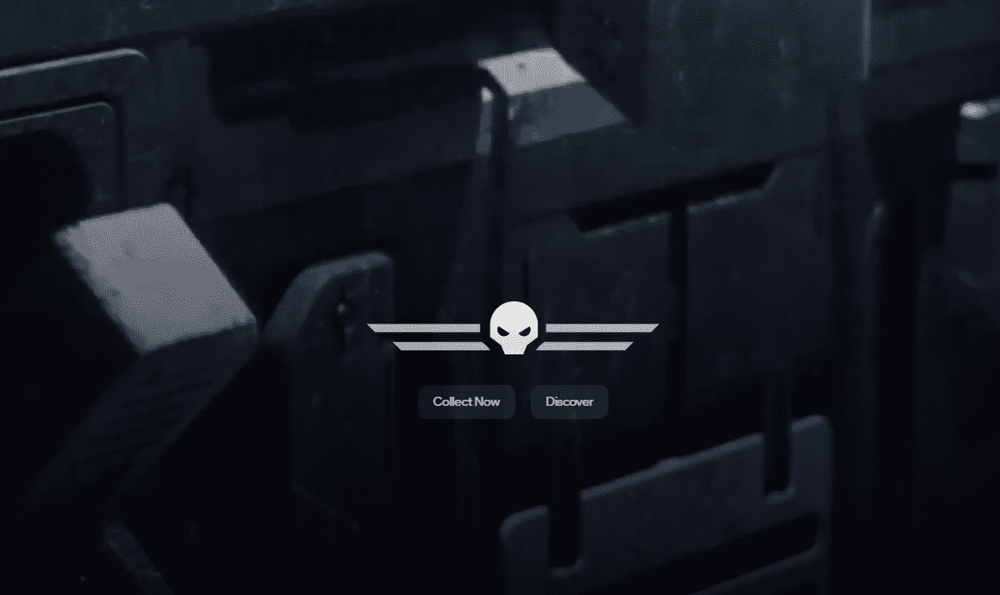

# Frontier Game

Frontier Game NFT 在过去 7 天内售出 54 次。Frontier Game 的总销售额为 7.44 万美元。一款 Frontier Game NFT 的平均价格为 137.8 美元。有 6,464 名 Frontier Game 所有者，总共拥有 56 个代币。

什么是前沿游戏？

Frontier Game 是一个 NFT（非同质代币）集合。存储在区块链上的数字艺术品集合。

有多少 Frontier Game 代币？

总共有 56 个 Frontier Game NFT。目前，6,464 位所有者的钱包中至少有一个 Frontier Game NTF。

Frontier Game 最昂贵的交易是什么？

售出的最昂贵的 Frontier Game NFT 是 [The Stellar Key](https://www.nft-stats.com/asset/0x236672ed575e1e479b8e101aeeb920f32361f6f9/38)。它于 2022 年 8 月 2 日（大约 1 个月前）以 470 美元的价格售出。

最近卖出了多少 Frontier Game？

过去 30 天内共售出 263 个 Frontier Game NFT。

 Frontier Game 需要多少钱？

过去 30 天，最便宜的 Frontier Game NFT 销售额低于 26 美元，最高销售额超过 407 美元。Frontier Game NFT 的中位价格在过去 30 天内为 51 美元。

