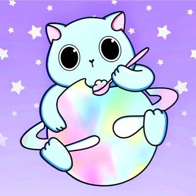

# FroyoKittens V2

**froyo kittens**是一个社区驱动的 NFT 集合，由以太坊上 10,000 个独特的手工制作和算法生成的 NFT 组成

froyo kittens 是由 jessie morii 手绘和创作的系列。froyo 小猫美学的组合是根据 444 种手绘特征定制生成的，因此每只小猫都是独一无二的，并且由 100% 的爱和可爱的点缀制成！

超级稀有的小猫

有 10 只独一无二的 froyo 小猫被 jessie 磨砂，它们不与任何其他 froyo 小猫分享它们的特征

